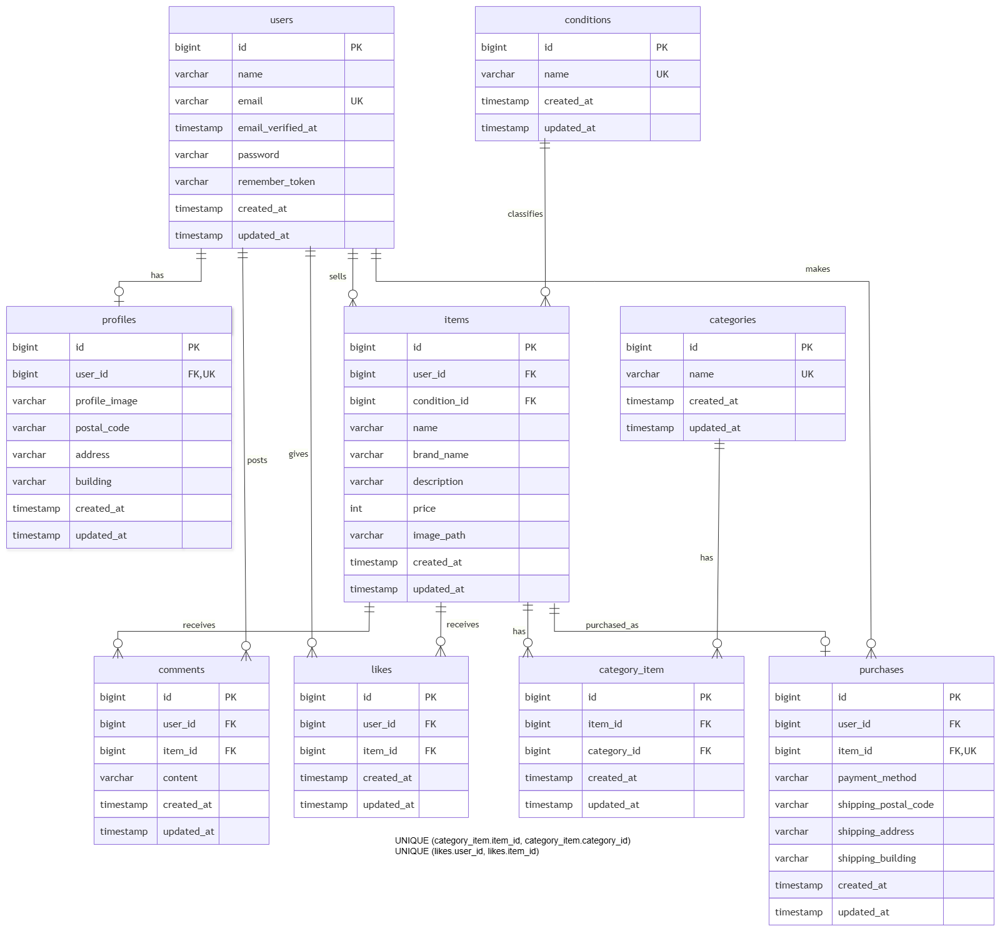

# coachtechフリマ

## 環境構築

### Dockerビルド

```bash
git clone https://github.com/takeotaira/coachtech-flea-market.git
cd coachtech-flea-market
docker-compose up -d --build
```

### Laravel環境構築

```bash
docker-compose exec php bash
composer install
cp .env.example .env
```

`.env`を次のように設定します。

```env
DB_CONNECTION=mysql
DB_HOST=mysql
DB_PORT=3306
DB_DATABASE=laravel_db
DB_USERNAME=laravel_user
DB_PASSWORD=laravel_pass

STRIPE_KEY=
STRIPE_SECRET=
```

```bash
php artisan key:generate
php artisan migrate
php artisan db:seed
php artisan storage:link
```

## 使用技術

- PHP 8.1
- Laravel 10.50.3
- Laravel Fortify 1.36.2
- MySQL 8.0.26
- Nginx 1.21.1
- Stripe PHP 21.3.1
- Docker Compose 3.8

## ER図



## URL

- 商品一覧画面：http://localhost/
- 会員登録画面：http://localhost/register
- ログイン画面：http://localhost/login
- phpMyAdmin：http://localhost:8080/
- MailHog：http://localhost:8025/